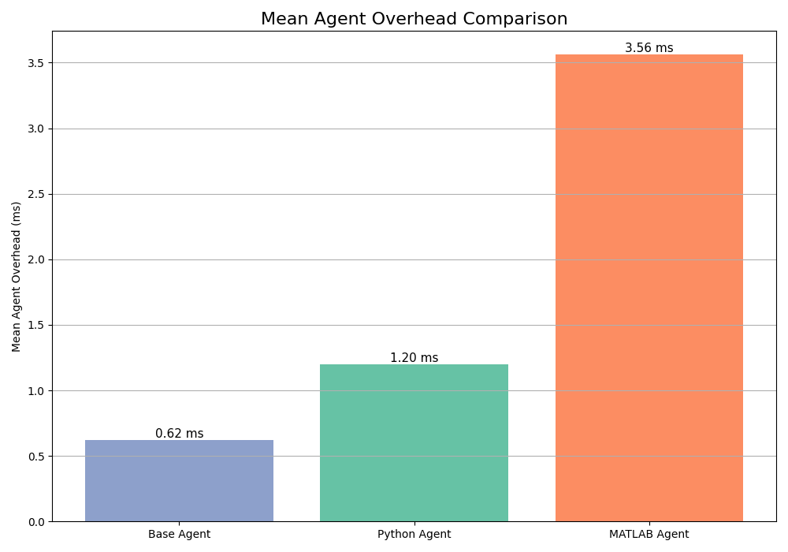
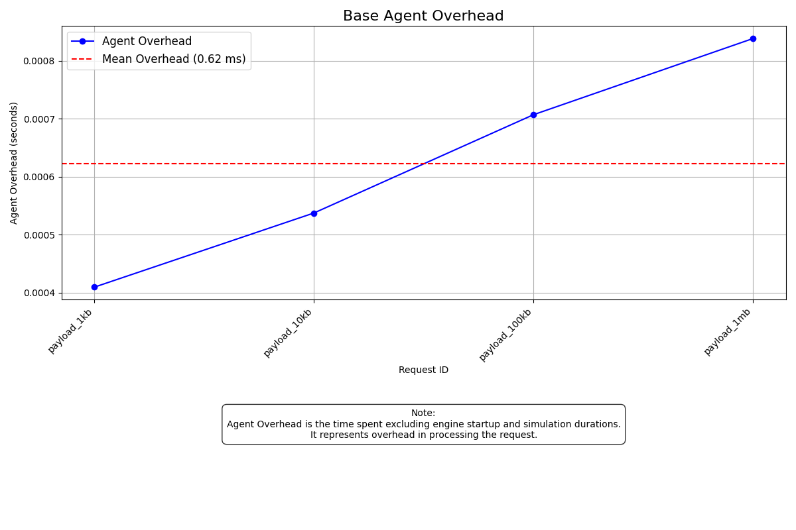
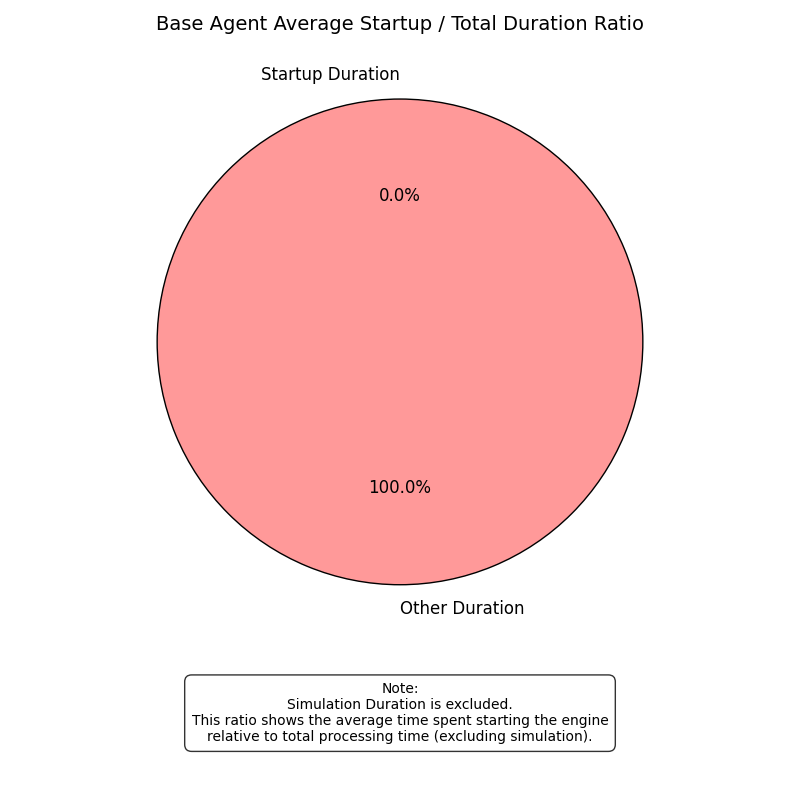
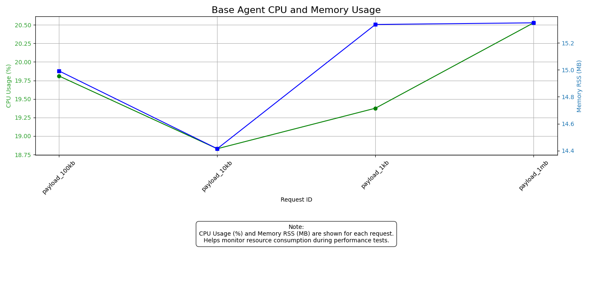
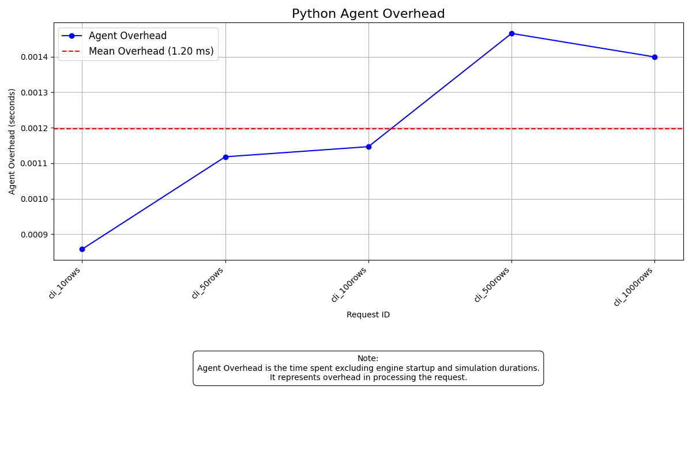
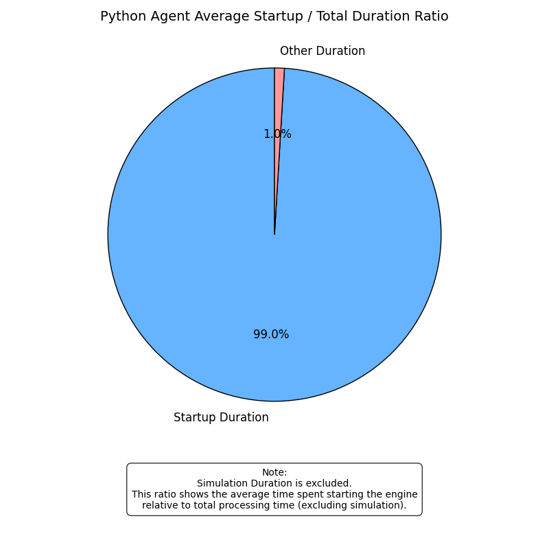
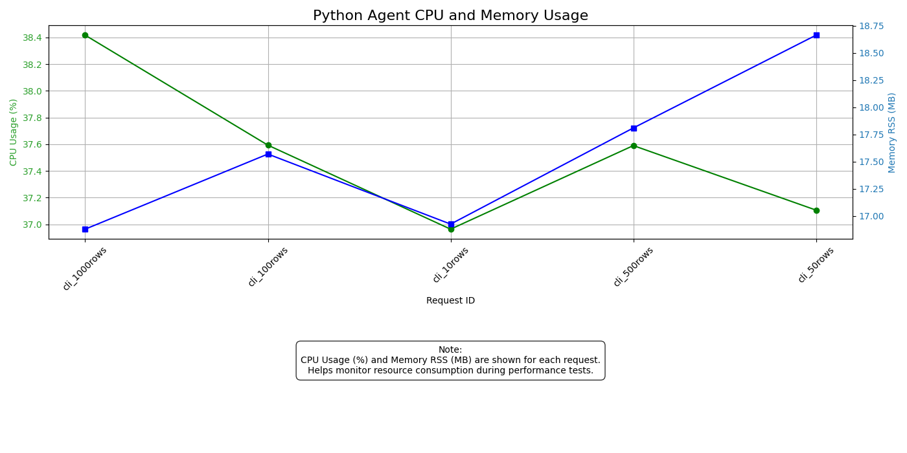
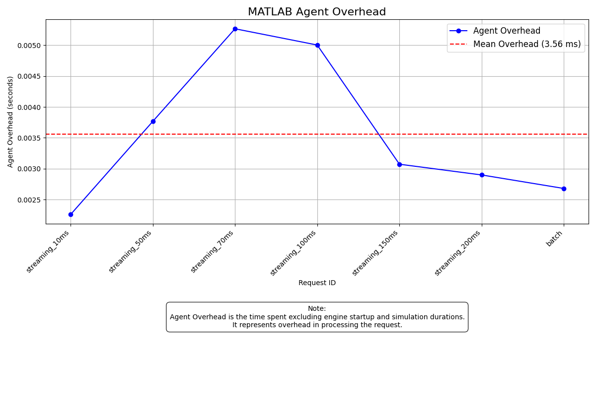
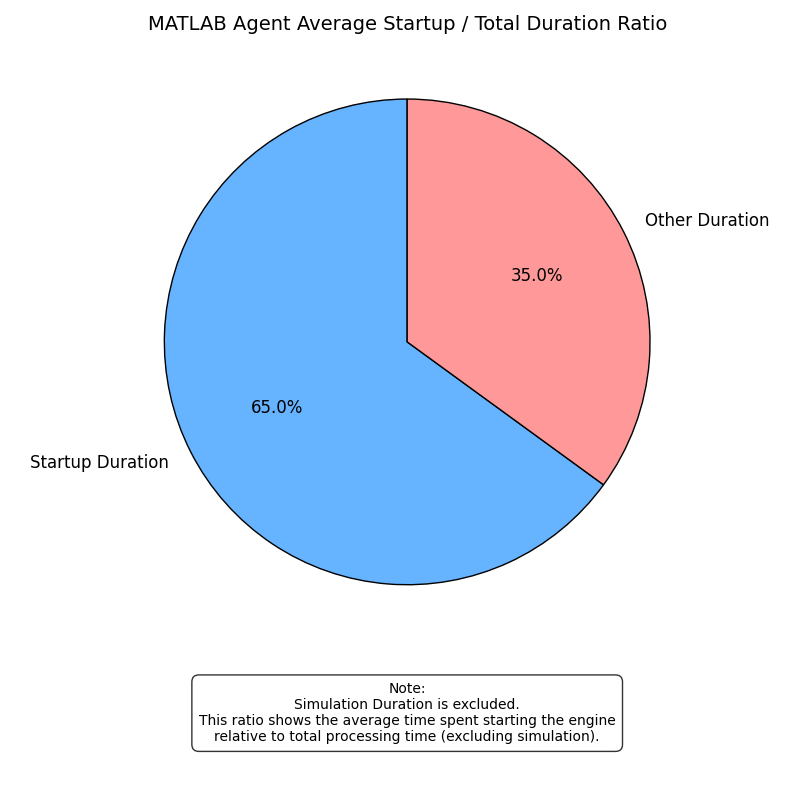
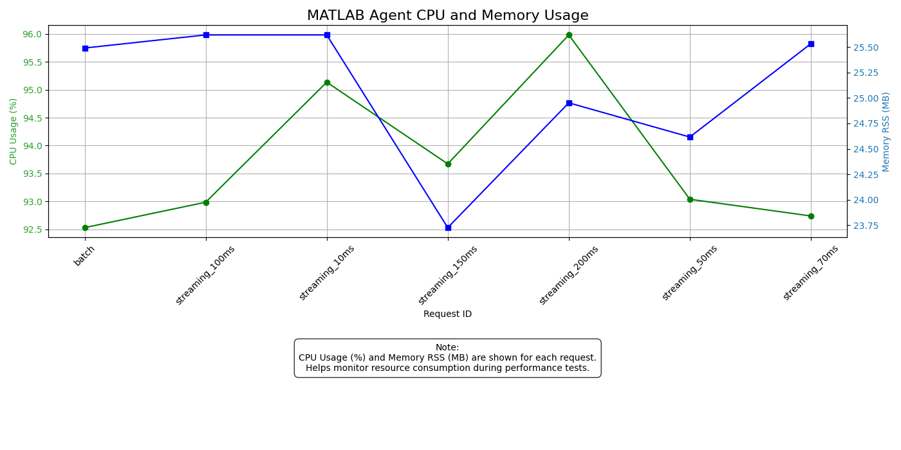

# Agent Performance Analysis Report

Performance measurements for the base, Python and MATLAB agents, derived from synthetic session logs that reproduce each agent's `PerformanceMonitor` schema without running the real simulations.

## Summary

| Agent | Mean Overhead (ms) | Startup/Total Ratio | Mean CPU (%) | Mean Memory (MB) |
|-------|--------------------|---------------------|--------------|------------------|
| Base Agent | 0.62 | 0.0000 | 19.64 | 15.02 |
| Python Agent | 1.20 | 0.9905 | 37.53 | 17.57 |
| MATLAB Agent | 3.56 | 0.6499 | 93.73 | 25.08 |

---

## Base Agent

> **Mean Agent Overhead:** `0.62 ms`

> **Mean Startup / Total Duration Ratio:** `0.0000`

> **Mean CPU Usage:** `19.64%`

> **Mean Memory RSS:** `15.02 MB`

| Operation ID | Agent Overhead (ms) |
|--------------|---------------------|
| payload_1kb | 0.41 |
| payload_10kb | 0.54 |
| payload_100kb | 0.71 |
| payload_1mb | 0.84 |

---

## Python Agent

> **Mean Agent Overhead:** `1.20 ms`

> **Mean Startup / Total Duration Ratio:** `0.9905`

> **Mean CPU Usage:** `37.53%`

> **Mean Memory RSS:** `17.57 MB`

| Operation ID | Agent Overhead (ms) |
|--------------|---------------------|
| cli_10rows | 0.86 |
| cli_50rows | 1.12 |
| cli_100rows | 1.15 |
| cli_500rows | 1.47 |
| cli_1000rows | 1.40 |

---

## MATLAB Agent

> **Mean Agent Overhead:** `3.56 ms`

> **Mean Startup / Total Duration Ratio:** `0.6499`

> **Mean CPU Usage:** `93.73%`

> **Mean Memory RSS:** `25.08 MB`

| Operation ID | Agent Overhead (ms) |
|--------------|---------------------|
| streaming_10ms | 2.26 |
| streaming_50ms | 3.77 |
| streaming_70ms | 5.27 |
| streaming_100ms | 5.00 |
| streaming_150ms | 3.07 |
| streaming_200ms | 2.90 |
| batch | 2.68 |

---
